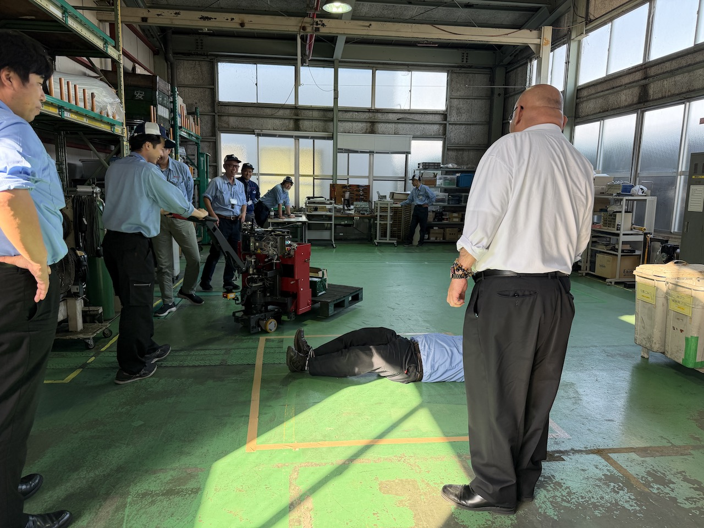
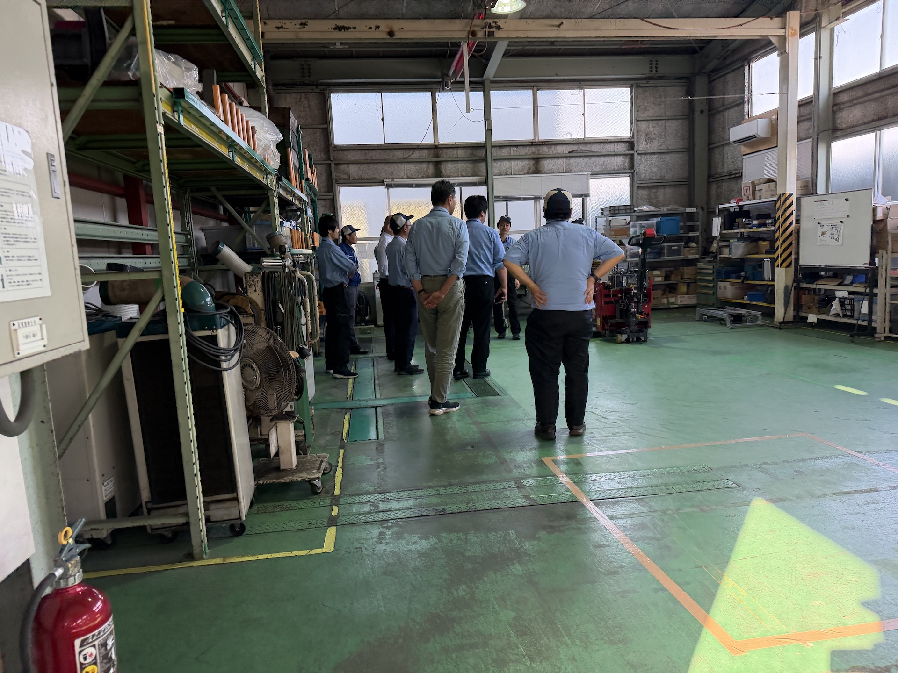
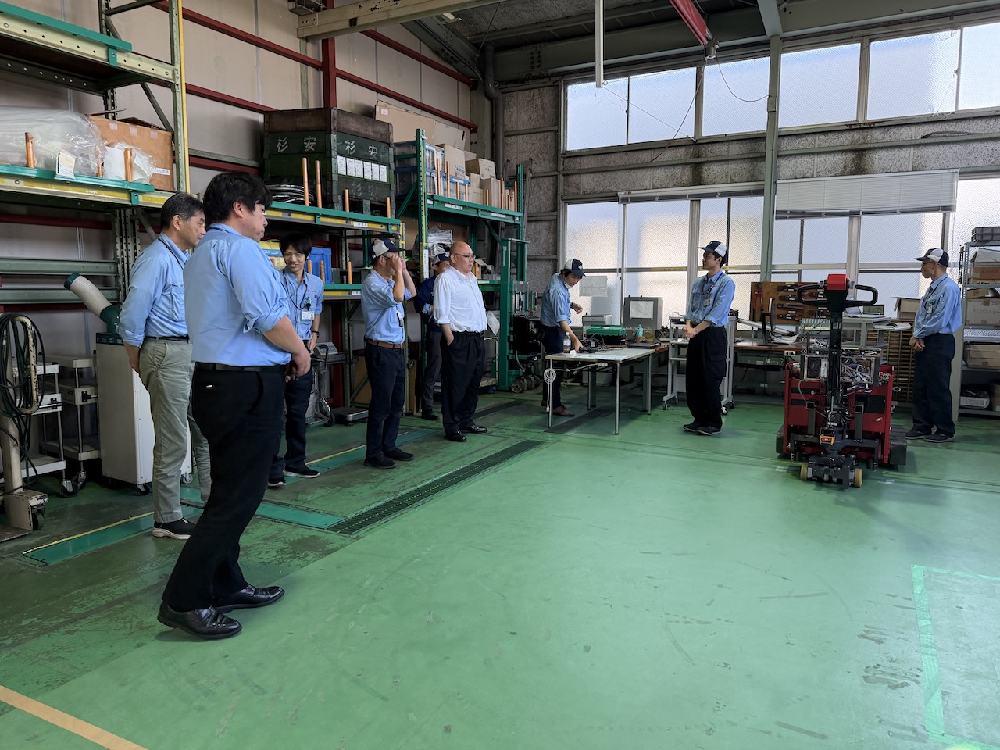
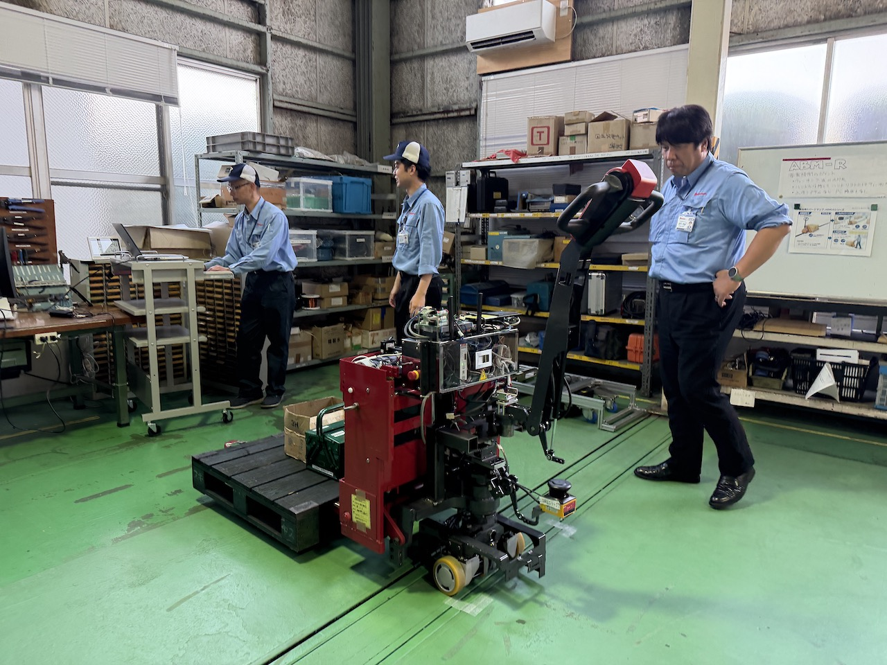

**展示場にて社長に見てもらった**

日時:2026-5-15(Fri)
場所:展示場AMRテストコーナー
出席者:社長、溝井他校友会メンバー
　　　　山崎、廣田、前川、奥村、佐倉、他

**内容**

社長に対しての、
AMR（ABMR）の初めてのプレゼンテーション

終始笑いの絶えない雰囲気の中、
我々が取り組んでいるAMR研究が、
会社として前向きに捉えられていることを確認した。

奥村、佐倉にて予め準備していたティーチング済デモが、
いざ本番という時になって、反応せず・・・

アルアルである

なんとか切り抜けて、デモを成功させた

社長のノリで、Sの字走行など、
これまでやったなかったことに、現場で対応

なんと、思いの外うまく動いた

