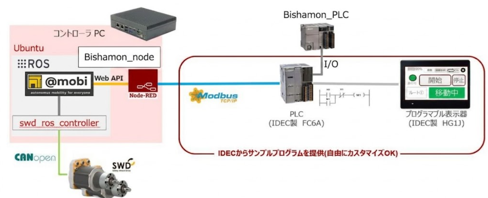

# このフォルダ"IDEC_ABMR"について
2026.5.25 奥村貴史
## はじめに
このフォルダはIDECのAMRキットをABM15本体へ移植したティーチング式のハンド型AMRにインストールされているデータを管理しています
このフォルダ直下にはIDEC製PLCのラダープログラムと、同じくIDECのタッチパネル作画データを入れています
それに加えて以下のフォルダが存在します
## フォルダ名とその内容
- ハンドル角入力部_originalPLC
  ハンドル切れ角を読み取るポテンショメータのアナログデータをオリジナルPLC込み、8bitのIOに変換してIDECのPLCへ渡しています。そのラダープログラムが入っています
   
- ROS
  AMRのソフトウェア@mobiはROS1 melodicで動いており、自作ノードとやりとりできますし、自作ノードから直接駆動モータを制御することも可能です。自作のコードはここに入っています
   
## システムのブロック図は以下の通り

